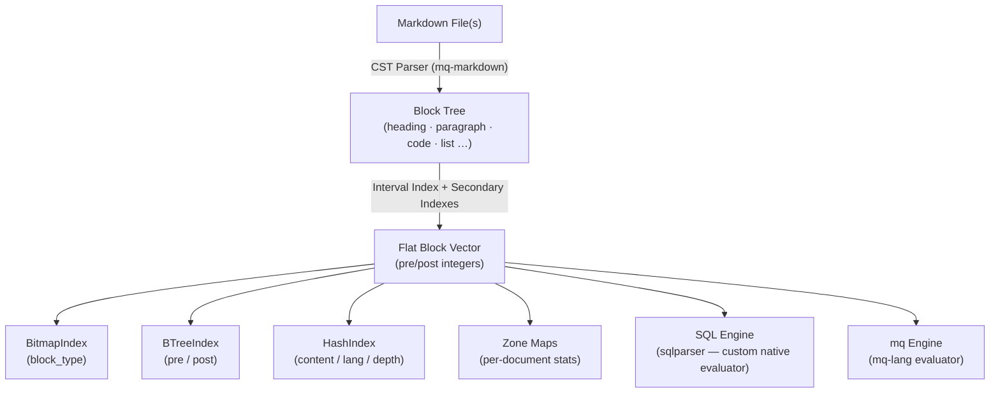
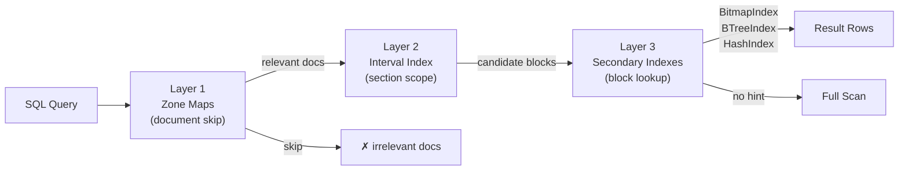
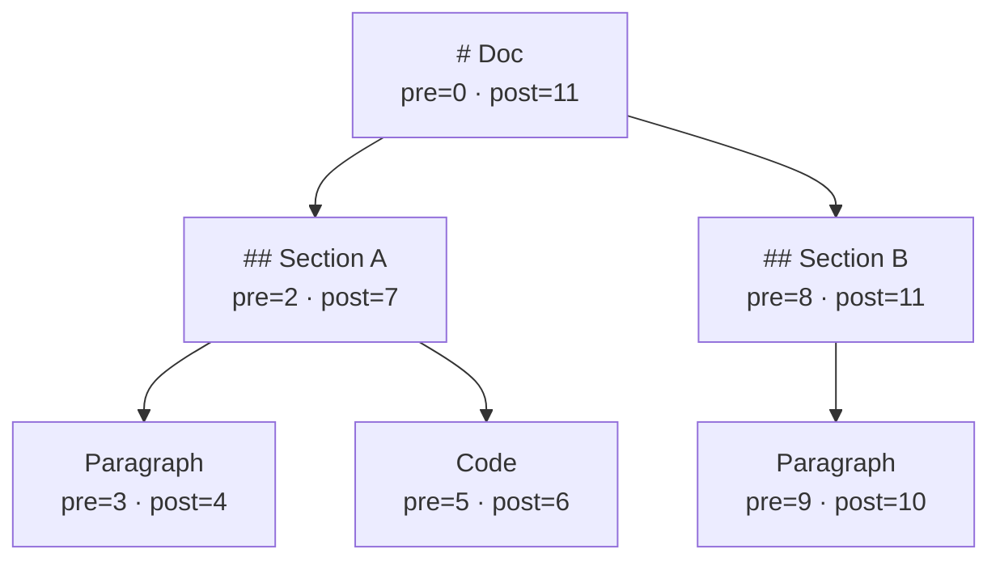
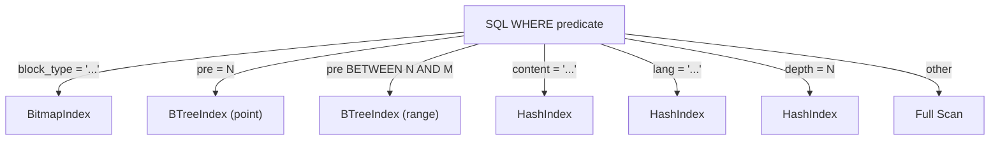
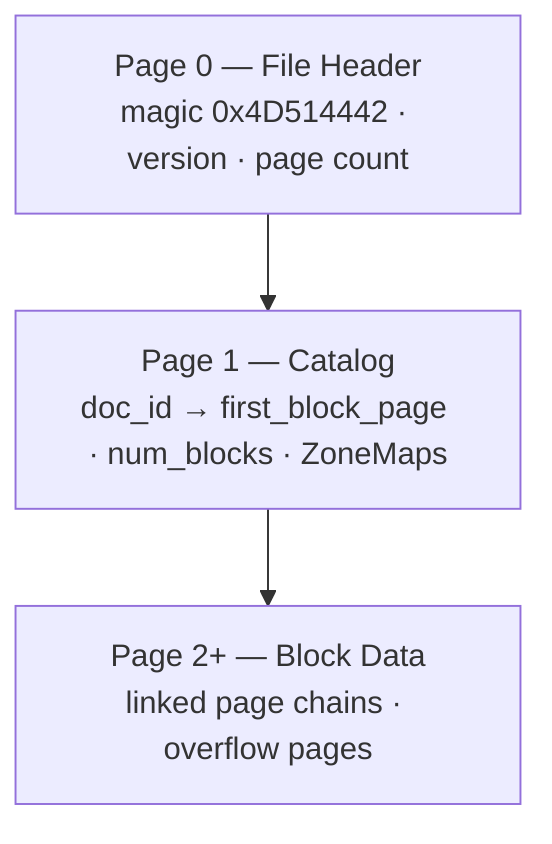

<div align="center">
  

<h1>mq-db</h1>

**Markdown-specialized embedded database with interval-indexed block storage and hierarchical query support.**

[](https://github.com/harehare/mq-db/actions/workflows/ci.yml)
[](https://github.com/harehare/mq-db/actions/workflows/audit.yml)
[](LICENSE)


</div>

`mq-db` treats Markdown documents as **structured, hierarchical databases** rather than plain text. It parses Markdown into a flat block list with an **interval index** (Nested Set / Pre-Post Order), enabling O(1) section hierarchy queries. Documents can be queried with **SQL** or **[mq](https://github.com/harehare/mq)** and persisted to a compact custom page-file format.



> [!IMPORTANT]
> This project is under active development and the API may change.

## Features

- **Flat block storage** — every Markdown element becomes a typed `Block` with row-polymorphic properties
- **O(1) hierarchy queries** — interval index (`pre`/`post`) makes ancestor/descendant checks a single integer comparison
- **Three-layer secondary indexes** — `BitmapIndex` (block type), `BTreeIndex` (pre/post), `HashIndex` (content/lang/depth) for fast SQL predicate pushdown
- **Zone Maps** — per-document statistics skip irrelevant files before scanning any blocks
- **Dual query engines** — SQL via a custom `sqlparser`-based evaluator, and `mq` via `mq-lang`
- **DDL support** — `CREATE TABLE`, `INSERT INTO`, `DROP TABLE` for in-memory custom tables
- **`mq()` scalar function** — run an mq program against Markdown content inline in SQL
- **Custom page-file persistence** — 8 KB fixed pages, checksums, atomic writes
- **CLI + interactive REPL + TUI** — full terminal experience

## Installation

### Using the Installation Script (Recommended)

```bash
curl -fsSL https://raw.githubusercontent.com/harehare/mq-db/main/bin/install.sh | bash
```

The installer will:
- Download the latest release for your platform
- Verify the binary with SHA256 checksum
- Install to `~/.local/bin/`
- Update your shell profile (bash, zsh, or fish)

After installation, restart your terminal or run:
```bash
source ~/.bashrc  # or ~/.zshrc, or ~/.config/fish/config.fish
```

### Using Cargo

```bash
cargo install mq-db
```

### From Source

```bash
# Latest Development Version
cargo install --git https://github.com/harehare/mq-db.git
```

### Supported Platforms

- **Linux**: x86_64, aarch64
- **macOS**: x86_64 (Intel), aarch64 (Apple Silicon)
- **Windows**: x86_64

## CLI Usage

### Index Markdown files

```bash
mq-db index docs/ --recursive --output store.mq-db
mq-db index README.md DESIGN.md
mq-db index docs/ --no-spans   # omit source spans (~21 bytes/block saved)
```

```
  ✓ docs/DESIGN.md
  ✓ docs/API.md

Indexed 2 files → store.mq-db
```

### List indexed documents

```bash
mq-db list --db store.mq-db
mq-db list --db store.mq-db --format json   # also: csv, tsv, markdown, html
```

```
┌──────┬────────────────────────────────────────────────────┬────────┬──────────┐
│   ID │ Path / Title                                       │ Blocks │ Tags     │
├──────┼────────────────────────────────────────────────────┼────────┼──────────┤
│    0 │ docs/DESIGN.md                                     │    142 │          │
│    1 │ docs/API.md                                        │     87 │ api, v2  │
└──────┴────────────────────────────────────────────────────┴────────┴──────────┘
2 documents
```

### SQL queries

```bash
mq-db sql "SELECT block_type, count(*) FROM blocks GROUP BY block_type" --db store.mq-db
mq-db sql --file query.sql --db store.mq-db           # read SQL from a file
mq-db sql "SELECT ..." --db store.mq-db --format json  # also: csv, tsv, markdown, html
```

```
┌─────────────┬──────────┐
│ block_type  │ count(*) │
├─────────────┼──────────┤
│ paragraph   │ 48       │
│ heading     │ 21       │
│ code        │ 15       │
└─────────────┴──────────┘
(3 rows)
```

**Hierarchy query with `under()`** — find all content inside a specific section:

```bash
mq-db sql "
  SELECT b.block_type, b.content
  FROM blocks b
  WHERE under(b.pre, b.post,
    (SELECT pre FROM blocks WHERE block_type = 'heading' AND content = 'Architecture'),
    (SELECT post FROM blocks WHERE block_type = 'heading' AND content = 'Architecture'))
  ORDER BY b.pre
" --db store.mq-db
```

**`mq()` scalar function** — run an mq program against Markdown content inline:

```bash
mq-db sql "SELECT mq('.h1 | to_text', content) AS title FROM blocks WHERE block_type = 'code'" --db store.mq-db
```

### DDL — custom in-memory tables

```bash
# Create from a SELECT result
mq-db sql "CREATE TABLE headings AS SELECT content, depth FROM blocks WHERE block_type = 'heading'" --db store.mq-db

# Create with explicit schema, then insert
mq-db sql "CREATE TABLE notes (id TEXT, body TEXT)" --db store.mq-db
mq-db sql "INSERT INTO notes VALUES ('1', 'Hello world')" --db store.mq-db

# Inspect
mq-db sql "SHOW TABLES" --db store.mq-db
mq-db sql "DESC notes"  --db store.mq-db

# Drop
mq-db sql "DROP TABLE notes" --db store.mq-db
```

### mq queries

```bash
mq-db mq ".h1" --db store.mq-db
mq-db mq 'select(.code_lang == "rust")' --db store.mq-db
mq-db mq ".h1" --db store.mq-db --format markdown  # also: json, csv, tsv, html
```

### Interactive REPL

```bash
mq-db repl --db store.mq-db --mode sql
```

```
mq-db  (.help for commands  .quit to exit)
mode: sql  (.mode mq | .mode sql)

sql> SELECT content FROM blocks WHERE block_type = 'heading' LIMIT 3;
┌──────────────────┐
│ content          │
├──────────────────┤
│ Overview         │
│ Architecture     │
│ Query Engine     │
└──────────────────┘
(3 rows)

sql> .mode mq
→ mq mode
mq> .h2
## Architecture
## Query Engine
```

### HTTP server

```bash
mq-db serve --db store.mq-db              # listens on 127.0.0.1:7878
mq-db serve --db store.mq-db --port 8080  # custom port
mq-db serve --db store.mq-db --host 0.0.0.0 --port 8080
```

Three endpoints are available:

| Method | Path      | Body                   | Description                                          |
| ------ | --------- | ---------------------- | ---------------------------------------------------- |
| `GET`  | `/health` | —                      | `{"status":"ok","documents":<n>}`                    |
| `POST` | `/sql`    | `{"query":"SELECT …"}` | Execute a SQL query, returns JSON rows               |
| `POST` | `/mq`     | `{"code":".h1"}`       | Evaluate an mq expression, returns `{"results":[…]}` |

```bash
# Health check
curl http://127.0.0.1:7878/health

# SQL via HTTP
curl -s -X POST http://127.0.0.1:7878/sql \
  -H 'Content-Type: application/json' \
  -d '{"query":"SELECT block_type, count(*) FROM blocks GROUP BY block_type"}'

# mq via HTTP
curl -s -X POST http://127.0.0.1:7878/mq \
  -H 'Content-Type: application/json' \
  -d '{"code":".h1"}'
```

### Structural linting

```bash
mq-db lint --db store.mq-db --depth 2
```

```
✗  1 violation  (H2 immediately followed by list)

  file                                      heading
  ────────────────────────────────────────  ──────────────────────────────
  docs/DESIGN.md                            "Quick Start"
```

### Statistics

```bash
mq-db stats --db store.mq-db
```

```
  Documents  5
  Blocks     632

  Block types
  ────────────────────────────────────────────────────────
   ¶  paragraph    ████████████████████░░░░   241  (38%)
   #  heading      ████████░░░░░░░░░░░░░░░░    89  (14%)
  {}  code         ███████░░░░░░░░░░░░░░░░░    73  (12%)
   •  list         ██████░░░░░░░░░░░░░░░░░░    58   (9%)

  Code languages
  ────────────────────────────────────────────────────────
  {}  rust         ████████████████████████    41  (57%)
  {}  python       ██████████░░░░░░░░░░░░░░    18  (25%)
  {}  bash         ███████░░░░░░░░░░░░░░░░░    14  (19%)
```

### Show document structure

```bash
mq-db show 0 --db store.mq-db
```

```
  docs/DESIGN.md
  title   Design Document
  blocks  142

  pre   post  type               content
  ────  ────  ────────────────   ──────────────────────────────────────────
     0   141  heading H1         Design Document
     2    55  heading H2         Architecture
     4    21  paragraph          The system is built on…
    22    37  heading H3           Query Engine
    24    36  code                   fn main() { … }
```

### TUI

```bash
mq-db tui --db store.mq-db
```

```
 mq-db  SQL  Tab:switch  i:input  j/k:nav  d/u:scroll  q:quit
┌─ Documents ──────────┬─ SQL ────────────────────────────────────────────────┐
│ DESIGN.md            │ SELECT block_type, count(*) FROM blocks GROUP BY b_  │
│   142 blocks         ├─ Results ────────────────────────────────────────────┤
│ API.md               │ ┌─────────────┬──────────┐                           │
│   87 blocks  API     │ │ block_type  │ count(*) │                           │
│ README.md            │ ├─────────────┼──────────┤                           │
│   34 blocks          │ │ paragraph   │ 48       │                           │
└──────────────────────┴──────────────────────────────────────────────────────┘
 5 docs  632 blocks  3 rows
```

**Keys:**

| Key            | Action                   |
| -------------- | ------------------------ |
| `i`            | Focus query input        |
| `Esc`          | Blur input               |
| `Enter`        | Run query                |
| `Tab`          | Toggle mq / SQL mode     |
| `j` / `k`      | Navigate document list   |
| `d` / `u`      | Scroll results down / up |
| `g` / `G`      | Jump to top / bottom     |
| `q` / `Ctrl+C` | Quit                     |

## Library API

```rust
use mq_db::{DocumentStore, SqlEngine, MqEngine, block::BlockType};

// ── Build in memory ──────────────────────────────────────────────────────────
let mut store = DocumentStore::new();
store.add_file("docs/DESIGN.md")?;
store.add_str("# Hello\n\n## Architecture\n\nDetails\n")?;

// Chainable query API — zone-map skip + interval scope + block predicates
let chunks = store.query()
    .documents(|doc| doc.zone_maps.heading_contents.contains("Architecture"))
    .under_heading("Architecture", Some(2))
    .filter(|b| matches!(b.block_type, BlockType::Paragraph | BlockType::Code))
    .blocks();

// SQL engine (custom sqlparser-based evaluator — no SQLite dependency)
let engine = SqlEngine::new(&store)?;
let out = engine.execute(
    "SELECT content FROM blocks WHERE block_type = 'heading' ORDER BY pre"
)?;
print!("{}", out.to_table());

// mq engine
let results = MqEngine::eval_store(".h1", &store)?;

// Structural lint
let violations = store.query().lint_heading_followed_by(2, &[BlockType::List]);

// ── Persist / load ───────────────────────────────────────────────────────────
store.save("store.mq-db")?;

// Full load — all blocks read into memory, indexes built on first SqlEngine use
let store = DocumentStore::load("store.mq-db")?;

// Lazy open — catalog only; call load_all_blocks() + load_all_indexes() before SQL
let mut store = DocumentStore::open("store.mq-db")?;
store.load_all_blocks()?;
store.load_all_indexes()?;

// Catalog-only — for metadata commands (list, stats) that don't need block data
let store = DocumentStore::load_catalog_only("store.mq-db")?;
```

## SQL Reference

### Virtual schema

```sql
SELECT id, path, title, tags FROM documents;

SELECT id, document_id, block_type, content, pre, post,
       depth, lang, properties FROM blocks;
```

### Built-in functions

| Function                              | Description                                |
| ------------------------------------- | ------------------------------------------ |
| `under(pre, post, anc_pre, anc_post)` | O(1) interval ancestor check               |
| `mq(program, content)`                | Run an mq program against Markdown content |
| `json_extract(json, path)`            | Extract a value from a JSON string         |
| `count(*) / min / max / sum / avg`    | Aggregate functions                        |
| `lower / upper / length / coalesce`   | Scalar utilities                           |

### DDL statements

| Statement                         | Description                                       |
| --------------------------------- | ------------------------------------------------- |
| `CREATE TABLE name AS SELECT …`   | Create a custom table from a query result         |
| `CREATE TABLE name (col TYPE, …)` | Create an empty custom table with explicit schema |
| `INSERT INTO name VALUES (…)`     | Insert a row into a custom table                  |
| `DROP TABLE name`                 | Drop a custom table                               |
| `SHOW TABLES`                     | List all custom tables                            |
| `DESC name`                       | Show schema of a custom table                     |

### Example queries

```sql
-- All text/code under a specific section (RAG extraction)
SELECT b.block_type, b.content
FROM blocks b
WHERE under(b.pre, b.post,
  (SELECT pre FROM blocks WHERE block_type = 'heading' AND content = 'Architecture'),
  (SELECT post FROM blocks WHERE block_type = 'heading' AND content = 'Architecture'))
  AND b.block_type IN ('paragraph', 'code')
ORDER BY b.pre;

-- Extract H1 title from code block content via the mq() scalar function
SELECT mq('.h1 | to_text', content) AS title
FROM blocks
WHERE block_type = 'code' AND lang = 'markdown';

-- H2 headings immediately followed by a list (structural lint)
SELECT d.path, h.content AS heading
FROM blocks h
JOIN blocks nxt ON nxt.document_id = h.document_id AND nxt.pre = h.pre + 1
JOIN documents d ON d.id = h.document_id
WHERE h.block_type = 'heading' AND depth = 2 AND nxt.block_type = 'list';

-- Documents containing Python code
SELECT DISTINCT d.path
FROM documents d JOIN blocks b ON b.document_id = d.id
WHERE b.block_type = 'code' AND lang = 'python';
```

## Architecture

### Block model

Every Markdown element becomes a `Block`:

```rust
struct Block {
    id: u32,
    document_id: u32,
    block_type: BlockType,  // Heading, Paragraph, Code, List, …
    content: String,
    span: Option<Span>,     // line/column for editor sync
    pre: u32,               // interval index pre-order
    post: u32,              // interval index post-order
    properties: Properties, // row-polymorphic extra attributes
}
```

| Block type      | Properties                                          |
| --------------- | --------------------------------------------------- |
| `Heading`       | `{ "depth": 2, "slug": "architecture" }`            |
| `Code`          | `{ "lang": "rust", "meta": "no_run" }`              |
| `List`          | `{ "ordered": false, "level": 1, "checked": null }` |
| `Yaml` / `Toml` | parsed front-matter keys (`"title"`, `"tags"`, …)   |

### Index layers

mq-db applies three complementary index layers, cheapest-first.



#### Layer 1 — Zone Maps (document-level skip)

Built once per document and stored in the `.mq-db` file. Checked before any block is read:

| Field               | Skips documents where…               |
| ------------------- | ------------------------------------ |
| `heading_contents`  | The requested heading text is absent |
| `code_languages`    | The requested language tag is absent |
| `max_heading_depth` | The requested depth cannot exist     |
| `tags`              | The tag filter cannot match          |

#### Layer 2 — Interval Index (section hierarchy)

Heading hierarchy encoded as `(pre, post)` pairs via Pre-Post Order (Nested Set) traversal:



`A is_under B` ↔ `B.pre < A.pre AND A.post < B.post` — O(1), no tree traversal.

#### Layer 3 — Secondary Indexes (block-level fast lookup)

| Index         | Column(s)                  | Structure              | Complexity                         |
| ------------- | -------------------------- | ---------------------- | ---------------------------------- |
| `BitmapIndex` | `block_type`               | Inverted list per type | O(1) key + O(k) iterate            |
| `BTreeIndex`  | `pre`, `post`              | `BTreeMap`             | O(log n) point, O(log n + k) range |
| `HashIndex`   | `content`, `lang`, `depth` | `HashMap`              | O(1) average                       |

SQL predicate pushdown picks an `IndexHint`:



### Storage format

Custom 8 KB page file:



Writes are atomic: data goes to `<path>.tmp` then renamed to `<path>` on success.

## License

[MIT](LICENSE)
