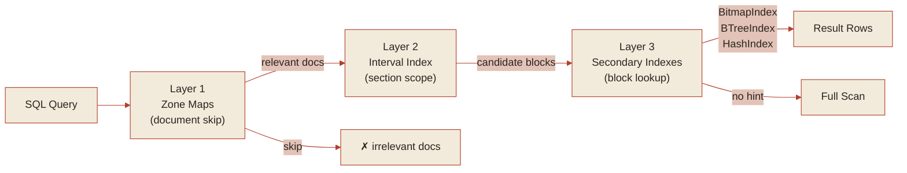
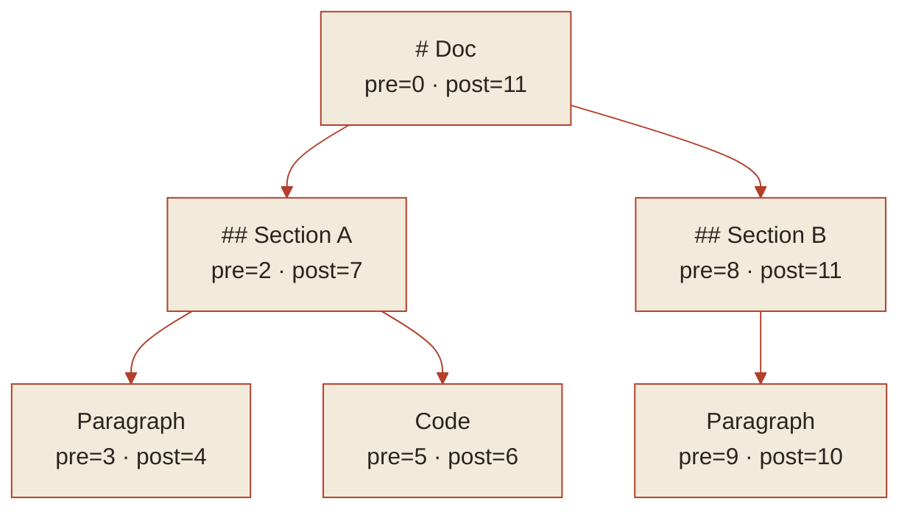
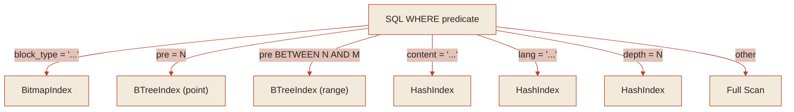
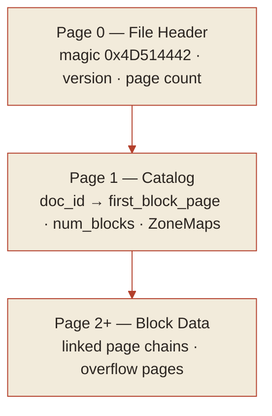

<div align="center">
  

<h1>mq-db</h1>

**Markdown-specialized embedded database with interval-indexed block storage and hierarchical query support.**

[](https://github.com/harehare/mq-db/actions/workflows/ci.yml)
[](https://github.com/harehare/mq-db/actions/workflows/audit.yml)
[](https://crates.io/crates/mq-db)
[](LICENSE)


</div>

`mq-db` treats Markdown documents as **structured, hierarchical databases** rather than plain text. It parses Markdown into a flat block list with an **interval index** (Nested Set / Pre-Post Order), enabling O(1) section hierarchy queries. Documents can be queried with **SQL** or **[mq](https://github.com/harehare/mq)** and persisted to a compact custom page-file format.


```mermaid
%%{init: {'theme':'base', 'themeVariables': {'primaryColor':'#f2ebdb','primaryTextColor':'#2a2420','primaryBorderColor':'#b3402c','lineColor':'#b3402c','secondaryColor':'#e3c3b7','tertiaryColor':'#faf6ef','background':'#faf6ef','fontFamily':'JetBrains Mono, monospace'}}}%%
flowchart TD
    A["Markdown File(s)"] -->|"CST Parser (mq-markdown)"| B["Block Tree\n(heading · paragraph · code · list …)"]
    B -->|"Interval Index + Secondary Indexes"| C["Flat Block Vector\n(pre/post integers)"]
    C --> D["BitmapIndex\n(block_type)"]
    C --> E["BTreeIndex\n(pre / post)"]
    C --> F["HashIndex\n(content / lang / depth)"]
    C --> G["Zone Maps\n(per-document stats)"]
    C --> H["SQL Engine\n(sqlparser — custom native evaluator)"]
    C --> I["mq Engine\n(mq-lang evaluator)"]
```

> [!IMPORTANT]
> This project is under active development and the API may change.

## Features

- **Flat block storage** — every Markdown element becomes a typed `Block` with row-polymorphic properties
- **O(1) hierarchy queries** — interval index (`pre`/`post`) makes ancestor/descendant checks a single integer comparison
- **Four-layer secondary indexes** — `BitmapIndex` (block type), `BTreeIndex` (pre/post), `HashIndex` (content/lang/depth), `TermIndex` (tokenized content, full-text) for fast SQL predicate pushdown
- **Zone Maps** — per-document statistics skip irrelevant files before scanning any blocks
- **Dual query engines** — SQL via a custom `sqlparser`-based evaluator, and `mq` via `mq-lang`
- **`WITH` / `WITH RECURSIVE` support** — common table expressions, usable in `FROM`, `JOIN`, and subqueries; recursive CTEs via iterative fixed-point evaluation
- **Full-text search** — `match()`/`score()` SQL functions backed by a persisted per-document inverted index
- **`EXPLAIN` / `EXPLAIN ANALYZE`** — see the zone-map/index/join plan a query resolves to, with actual row/timing stats under `ANALYZE`
- **Incremental re-indexing** — re-running `index` skips unchanged files (content-hash based), replaces changed ones in place (same `DocumentId`), and can `--prune` deleted ones
- **SQL `INSERT`/`UPDATE`/`DELETE` with write-back** — add, edit, or remove `blocks` and push the change back to the source Markdown file, opt-in via `--write-back`
- **DDL support** — `CREATE TABLE`, `INSERT INTO`, `DROP TABLE` for in-memory custom tables
- **`CREATE VIEW`** — persisted, live (non-materialized) named queries, re-run on every reference
- **Comprehensive SQL function library** — string, numeric, null-handling, `CASE`, and aggregate functions comparable to a general-purpose RDBMS
- **`mq()` scalar function** — run an mq program against Markdown content inline in SQL
- **`read_csv()` / `read_json()` table functions** — query external CSV/JSON Lines files directly in `FROM`, no import step
- **`ATTACH DATABASE` / `DETACH`** — query across multiple `.mq-db` stores as `<alias>.blocks`, session-scoped like SQLite
- **Custom page-file persistence** — 8 KB fixed pages, checksums, atomic writes
- **`vacuum`** — reclaim dead page chains left by write-back edits, `DROP TABLE`/`DROP VIEW`, and re-indexing changed files
- **CLI + interactive REPL + TUI** — full terminal experience

## Installation

### Using the Installation Script (Recommended)

```bash
curl -fsSL https://raw.githubusercontent.com/harehare/mq-db/main/bin/install.sh | bash
```

The installer will:
- Download the latest release for your platform
- Verify the binary with SHA256 checksum
- Install to `~/.local/bin/`
- Update your shell profile (bash, zsh, or fish)

After installation, restart your terminal or run:
```bash
source ~/.bashrc  # or ~/.zshrc, or ~/.config/fish/config.fish
```

### Using Cargo

```bash
cargo install mq-db
```

### From Source

```bash
# Latest Development Version
cargo install --git https://github.com/harehare/mq-db.git
```

### Supported Platforms

- **Linux**: x86_64, aarch64
- **macOS**: x86_64 (Intel), aarch64 (Apple Silicon)
- **Windows**: x86_64

## CLI Usage

### Index Markdown files

```bash
mq-db index docs/ --recursive --output store.mq-db
mq-db index README.md DESIGN.md
mq-db index docs/ --no-spans   # omit source spans (~21 bytes/block saved)
```

```
  + docs/DESIGN.md
  + docs/API.md

2 added, 0 updated, 0 unchanged, 0 removed → store.mq-db
```

Re-running `index` against an existing `--output` is **incremental**: files
whose content hash hasn't changed are skipped, changed files are re-parsed
in place (keeping the same `DocumentId`), and new files are added. Pass
`--prune` to also drop catalogued documents whose file no longer exists:

```bash
mq-db index docs/ --recursive --output store.mq-db --prune
```

### List indexed documents

```bash
mq-db list --db store.mq-db
mq-db list --db store.mq-db --format json   # also: csv, tsv, markdown, html
```

```
┌──────┬────────────────────────────────────────────────────┬────────┬──────────┐
│   ID │ Path / Title                                       │ Blocks │ Tags     │
├──────┼────────────────────────────────────────────────────┼────────┼──────────┤
│    0 │ docs/DESIGN.md                                     │    142 │          │
│    1 │ docs/API.md                                        │     87 │ api, v2  │
└──────┴────────────────────────────────────────────────────┴────────┴──────────┘
2 documents
```

### SQL queries

```bash
mq-db sql "SELECT block_type, count(*) FROM blocks GROUP BY block_type" --db store.mq-db
mq-db sql --file query.sql --db store.mq-db           # read SQL from a file
mq-db sql "SELECT ..." --db store.mq-db --format json  # also: csv, tsv, markdown, html
```

```
┌─────────────┬──────────┐
│ block_type  │ count(*) │
├─────────────┼──────────┤
│ paragraph   │ 48       │
│ heading     │ 21       │
│ code        │ 15       │
└─────────────┴──────────┘
(3 rows)
```

**Hierarchy query with `under()`** — find all content inside a specific section:

```bash
mq-db sql "
  SELECT b.block_type, b.content
  FROM blocks b
  WHERE under(b.pre, b.post,
    (SELECT pre FROM blocks WHERE block_type = 'heading' AND content = 'Architecture'),
    (SELECT post FROM blocks WHERE block_type = 'heading' AND content = 'Architecture'))
  ORDER BY b.pre
" --db store.mq-db
```

**`mq()` scalar function** — run an mq program against Markdown content inline:

```bash
mq-db sql "SELECT mq('.h1 | to_text', content) AS title FROM blocks WHERE block_type = 'code'" --db store.mq-db
```

**CTE (`WITH`)** — name an intermediate result and reuse it in the main query, a join, or a subquery:

```bash
mq-db sql "
  WITH headings AS (SELECT content, pre, post FROM blocks WHERE block_type = 'heading')
  SELECT content FROM headings WHERE pre < 10 ORDER BY pre
" --db store.mq-db
```

A CTE's (and a view's — see below) output columns are recovered from their
rendered text, so arithmetic/numeric comparisons on them (`WHERE pre < 10`
above) work as expected, but this is a heuristic, not a real type system: a
value that merely *looks* numeric (e.g. a text cell containing `"007"`)
round-trips as a number, and a float's trailing zeros aren't preserved.

**`WITH RECURSIVE`** — the standard `<anchor> UNION [ALL] <recursive term>` shape, evaluated by iterative fixed-point: the anchor runs once, then the recursive term re-runs against only the *previous iteration's new rows* until it produces none. `UNION` (not `ALL`) dedupes against every row produced so far, which is also what makes a query that would otherwise cycle forever terminate. A hard cap of 10,000 iterations guards against a recursive term with no terminating condition. The recursive term must reference the CTE by name exactly once in its `FROM`; the anchor must not reference it at all.

```bash
# Number sequence — the canonical minimal recursive CTE
mq-db sql "
  WITH RECURSIVE seq AS (
    SELECT 1 AS n
    UNION ALL
    SELECT n + 1 FROM seq WHERE n < 10
  )
  SELECT n FROM seq ORDER BY n
" --db store.mq-db

# Heading ancestor chain via interval containment — walk up from a block's
# pre/post to every heading whose interval contains it
mq-db sql "
  WITH RECURSIVE ancestors AS (
    SELECT pre, post, content FROM blocks WHERE pre = 24
    UNION
    SELECT b.pre, b.post, b.content
    FROM blocks b, ancestors
    WHERE b.pre < ancestors.pre AND ancestors.post < b.post
      AND b.block_type = 'heading'
  )
  SELECT content FROM ancestors ORDER BY pre
" --db store.mq-db
```

A plain top-level `SELECT ... UNION SELECT ...` outside a recursive CTE is not supported. A CTE name identical to `blocks`, `documents`, or a custom table shadows it for the duration of the `WITH` clause's scope.

**Full-text search with `match()`/`score()`** — index-accelerated term matching and simple TF-based ranking:

```bash
mq-db sql "
  SELECT content, score(content, 'error handling') AS relevance
  FROM blocks
  WHERE match(content, 'error handling')
  ORDER BY relevance DESC
" --db store.mq-db
```

**`EXPLAIN` / `EXPLAIN ANALYZE`** — see which index (zone map, `BitmapIndex`, `BTreeIndex`, `HashIndex`, `TermIndex`, or full scan) a query's `WHERE`/`JOIN` resolves to, without running it. When more than one index is viable for the same `WHERE` clause, the choice is **cost-based** — each candidate's real matching-block count is read from its index, and the cheapest wins; `EXPLAIN` shows every candidate considered. Add `ANALYZE` to also run the query and report actual row counts, document-skip counts, and timing:

```bash
mq-db sql "EXPLAIN SELECT content FROM blocks WHERE block_type = 'code' AND lang = 'json'" --db store.mq-db
```

```
┌──────────────────────┬────────────────────────────────────────────────────────────────────────┐
│ step                 │ detail                                                                 │
├──────────────────────┼────────────────────────────────────────────────────────────────────────┤
│ query:from           │ blocks (blocks)                                                        │
│ query:where          │ HashIndex(lang = 'json') used (est. 2 row(s); also considered:          │
│                       │   BitmapIndex(block_type IN (code)) [est. 289])                        │
│ query:zone-map       │ eligible via lang                                                       │
│ query:where-recheck  │ row-by-row (full predicate re-evaluated after scan)                     │
└──────────────────────┴────────────────────────────────────────────────────────────────────────┘
```

```bash
mq-db sql "EXPLAIN ANALYZE SELECT * FROM blocks WHERE match(content, 'error handling')" --db store.mq-db
```

`WITH` CTEs are described separately (`cte:<name>:...` steps) before the outer query; `JOIN`s report whether they resolve to a hash join (equi-join `ON`) or a nested loop. Only `SELECT` queries are supported — `EXPLAIN` on other statements is rejected.

### Reading external CSV / JSON Lines

`read_csv(path)` and `read_json(path)` are table functions — use them anywhere a table name goes (`FROM`, `JOIN`, `CREATE TABLE ... AS SELECT`) to query an external file alongside `blocks`, no separate import step:

```bash
mq-db sql "SELECT name, age FROM read_csv('people.csv') WHERE age > 26" --db store.mq-db
mq-db sql "SELECT name FROM read_json('people.jsonl') WHERE active = true" --db store.mq-db

# Persist as a custom table
mq-db sql "CREATE TABLE people AS SELECT * FROM read_csv('people.csv')" --db store.mq-db
```

`read_csv` parses RFC 4180 (quoted fields, embedded commas/quotes/newlines); the first row is the header. `read_json` expects one JSON object per line (JSON Lines) — the column set is the union of every line's keys, in first-seen order. In both, numeric-looking values support arithmetic/comparison (`WHERE age > 26`), and a short/missing cell becomes `NULL` rather than erroring. Parquet is not supported (would need a large `parquet`/Arrow dependency); an unrecognized table function name (including `read_parquet`) is rejected with a clear error rather than silently misparsed.

### ATTACH — querying across multiple stores

`ATTACH DATABASE '<path>' AS <alias>` mounts another `.mq-db` store for the
session, queryable as `<alias>.blocks`, `<alias>.documents`, or any of its
views/custom tables — usable in `SELECT`, `JOIN`, subqueries, and CTEs.
`DETACH <alias>` unmounts it. Like SQLite, this is session-scoped only (not
saved into either store's file), so re-run `ATTACH` each session — or pass
`--attach path.mq-db:alias` (repeatable) to `sql`, `repl`, or `serve` to
attach automatically on startup:

```bash
mq-db repl --db project-a.mq-db --attach project-b.mq-db:b

sql> SELECT a.content, b.content FROM blocks a
     JOIN b.blocks b ON a.block_type = b.block_type
     WHERE a.block_type = 'heading';
```

Writes (`INSERT`/`UPDATE`/`DELETE`/`CREATE TABLE`) through an attached
alias are rejected — only the local store can be written to.

### INSERT / UPDATE / DELETE with write-back

`INSERT`/`UPDATE`/`DELETE` on `blocks` write the change back to the
document's *source Markdown file* (re-parsed in place, same `DocumentId`)
— pass `--write-back` to allow it; without the flag the statement is
rejected:

```bash
mq-db sql "UPDATE blocks SET content = 'New Title' WHERE block_type = 'heading' AND content = 'Old Title'" \
  --db store.mq-db --write-back

mq-db sql "DELETE FROM blocks WHERE content = 'Outdated paragraph'" \
  --db store.mq-db --write-back

# after_pre anchors the new block right after an existing block's `pre`;
# omit it to append at the end of the document.
mq-db sql "INSERT INTO blocks (document_id, block_type, content, depth, after_pre) VALUES (0, 'heading', 'New Section', 2, 4)" \
  --db store.mq-db --write-back

mq-db sql "INSERT INTO blocks (document_id, block_type, content) VALUES (0, 'paragraph', 'Appended at the end')" \
  --db store.mq-db --write-back
```

Limitations in this version:

- `UPDATE ... SET content` and `INSERT INTO blocks` only support `heading`/`paragraph` blocks (not tables, code, lists, ...)
- `INSERT INTO blocks` requires an explicit column list drawn from `document_id`, `block_type`, `content`, `depth` (required for `heading`, 1-6), `after_pre` (optional) — `INSERT ... SELECT` is not supported, only `VALUES`
- Only documents indexed **with spans** (the default; not `--no-spans`) and from a real file (not added via the library's `add_str`) are eligible
- Not available over `serve`'s HTTP endpoint or from `mq-mcp` — CLI (`sql`/`repl` with `--write-back`) and the library (`DocumentStore::execute_sql_mut`) only

### DDL — custom in-memory tables

```bash
# Create from a SELECT result
mq-db sql "CREATE TABLE headings AS SELECT content, depth FROM blocks WHERE block_type = 'heading'" --db store.mq-db

# Create with explicit schema, then insert
mq-db sql "CREATE TABLE notes (id TEXT, body TEXT)" --db store.mq-db
mq-db sql "INSERT INTO notes VALUES ('1', 'Hello world')" --db store.mq-db

# Inspect
mq-db sql "SHOW TABLES" --db store.mq-db
mq-db sql "DESC notes"  --db store.mq-db

# Drop
mq-db sql "DROP TABLE notes" --db store.mq-db
```

### Views

Unlike `CREATE TABLE name AS SELECT ...` (a frozen snapshot), a view is **not
materialized** — its `SELECT` re-runs on every reference, so it always
reflects current data, including `--write-back` edits and re-indexing. View
definitions persist to the `.mq-db` file, same as custom tables.

```bash
mq-db sql "CREATE VIEW headings AS SELECT content, depth FROM blocks WHERE block_type = 'heading'" --db store.mq-db
mq-db sql "SELECT * FROM headings WHERE depth = 1" --db store.mq-db

mq-db sql "SHOW TABLES" --db store.mq-db   # views are listed with kind = "view"
mq-db sql "DESC headings" --db store.mq-db

mq-db sql "CREATE OR REPLACE VIEW headings AS SELECT content FROM blocks WHERE block_type = 'heading'" --db store.mq-db
mq-db sql "DROP VIEW headings" --db store.mq-db
```

Limitations in this version:

- `CREATE VIEW v (a, b) AS ...` (explicit column list) is not supported
- A view and a custom table can't share a name
- A view's output columns are recovered from their rendered text, same as
  `WITH` CTEs (see the CTE section above for the trade-off this implies)

### mq queries

```bash
mq-db mq ".h1" --db store.mq-db
mq-db mq 'select(.code_lang == "rust")' --db store.mq-db
mq-db mq ".h1" --db store.mq-db --format markdown  # also: json, csv, tsv, html
```

### Interactive REPL

```bash
mq-db repl --db store.mq-db --mode sql
```

```
mq-db  (.help for commands  .quit to exit)
mode: sql  (.mode mq | .mode sql)

sql> SELECT content FROM blocks WHERE block_type = 'heading' LIMIT 3;
┌──────────────────┐
│ content          │
├──────────────────┤
│ Overview         │
│ Architecture     │
│ Query Engine     │
└──────────────────┘
(3 rows)

sql> .mode mq
→ mq mode
mq> .h2
## Architecture
## Query Engine
```

Pass `--write-back` to `repl` to allow `UPDATE`/`DELETE` on `blocks` in SQL mode:

```bash
mq-db repl --db store.mq-db --mode sql --write-back
```

### HTTP server

```bash
mq-db serve --db store.mq-db              # listens on 127.0.0.1:7878
mq-db serve --db store.mq-db --port 8080  # custom port
mq-db serve --db store.mq-db --host 0.0.0.0 --port 8080
```

`--host 0.0.0.0` exposes the query endpoints beyond localhost. When doing so, secure the server with an API key or Basic auth, and consider TLS and a rate limit:

```bash
mq-db serve --db store.mq-db --host 0.0.0.0 \
  --api-key "$MQ_DB_API_KEY" \
  --rate-limit 20 \
  --timeout 10 \
  --tls-cert cert.pem --tls-key key.pem
```

| Option                     | Description                                                                    |
| -------------------------- | -------------------------------------------------------------------------------- |
| `--timeout <SECS>`         | Abort a request and return `408` if it runs longer than this many seconds        |
| `--rate-limit <N>`         | Max requests per second per client IP; excess requests get `429`                 |
| `--api-key <KEY>`          | Require `Api-Key: <KEY>` or `Authorization: Bearer <KEY>` (env `MQ_DB_API_KEY`)   |
| `--basic-auth <USER:PASS>` | Require HTTP Basic auth (env `MQ_DB_BASIC_AUTH`)                                 |
| `--tls-cert` / `--tls-key` | PEM certificate/key pair to serve over HTTPS instead of plain HTTP               |

If both `--api-key` and `--basic-auth` are set, either credential grants access. `--tls-cert` and `--tls-key` must be provided together.

Three endpoints are available:

| Method | Path      | Body                   | Description                                          |
| ------ | --------- | ---------------------- | ---------------------------------------------------- |
| `GET`  | `/health` | —                      | `{"status":"ok","documents":<n>}`                    |
| `POST` | `/sql`    | `{"query":"SELECT …"}` | Execute a SQL query, returns JSON rows               |
| `POST` | `/mq`     | `{"code":".h1"}`       | Evaluate an mq expression, returns `{"results":[…]}` |

```bash
# Health check
curl http://127.0.0.1:7878/health

# SQL via HTTP
curl -s -X POST http://127.0.0.1:7878/sql \
  -H 'Content-Type: application/json' \
  -d '{"query":"SELECT block_type, count(*) FROM blocks GROUP BY block_type"}'

# mq via HTTP
curl -s -X POST http://127.0.0.1:7878/mq \
  -H 'Content-Type: application/json' \
  -d '{"code":".h1"}'
```

### Structural linting

```bash
mq-db lint --db store.mq-db --depth 2
```

```
✗  1 violation  (H2 immediately followed by list)

  file                                      heading
  ────────────────────────────────────────  ──────────────────────────────
  docs/DESIGN.md                            "Quick Start"
```

### Statistics

```bash
mq-db stats --db store.mq-db
```

```
  Documents  5
  Blocks     632

  Block types
  ────────────────────────────────────────────────────────
   ¶  paragraph    ████████████████████░░░░   241  (38%)
   #  heading      ████████░░░░░░░░░░░░░░░░    89  (14%)
  {}  code         ███████░░░░░░░░░░░░░░░░░    73  (12%)
   •  list         ██████░░░░░░░░░░░░░░░░░░    58   (9%)

  Code languages
  ────────────────────────────────────────────────────────
  {}  rust         ████████████████████████    41  (57%)
  {}  python       ██████████░░░░░░░░░░░░░░    18  (25%)
  {}  bash         ███████░░░░░░░░░░░░░░░░░    14  (19%)
```

### Compaction (VACUUM)

`UPDATE`/`DELETE` write-back, `DROP TABLE`/`DROP VIEW`, and re-indexing a changed file all replace or remove data by writing a fresh page chain and abandoning the old one — the `.mq-db` file only grows. `vacuum` rewrites the file from scratch (same compaction `save`/`index` already do for a brand-new file) and reclaims that dead space:

```bash
mq-db vacuum --db store.mq-db
```

```
  Pages before   190
  Pages after    123
  Reclaimed      536.0 KB
```

`VACUUM` as a SQL statement is recognized but redirects to this command rather than doing something different or silently failing — mq-db's compaction operates on the whole store file, not per-table, so it doesn't fit the `--write-back`/`execute_sql_mut` path the way `UPDATE`/`DELETE` do.

### Show document structure

```bash
mq-db show 0 --db store.mq-db
```

```
  docs/DESIGN.md
  title   Design Document
  blocks  142

  pre   post  type               content
  ────  ────  ────────────────   ──────────────────────────────────────────
     0   141  heading H1         Design Document
     2    55  heading H2         Architecture
     4    21  paragraph          The system is built on…
    22    37  heading H3           Query Engine
    24    36  code                   fn main() { … }
```

### TUI

```bash
mq-db tui --db store.mq-db
```

```
 mq-db  SQL  Tab:switch  i:input  j/k:nav  d/u:scroll  q:quit
┌─ Documents ──────────┬─ SQL ────────────────────────────────────────────────┐
│ DESIGN.md            │ SELECT block_type, count(*) FROM blocks GROUP BY b_  │
│   142 blocks         ├─ Results ────────────────────────────────────────────┤
│ API.md               │ ┌─────────────┬──────────┐                           │
│   87 blocks  API     │ │ block_type  │ count(*) │                           │
│ README.md            │ ├─────────────┼──────────┤                           │
│   34 blocks          │ │ paragraph   │ 48       │                           │
└──────────────────────┴──────────────────────────────────────────────────────┘
 5 docs  632 blocks  3 rows
```

**Keys:**

| Key            | Action                   |
| -------------- | ------------------------ |
| `i`            | Focus query input        |
| `Esc`          | Blur input               |
| `Enter`        | Run query                |
| `Tab`          | Toggle mq / SQL mode     |
| `j` / `k`      | Navigate document list   |
| `d` / `u`      | Scroll results down / up |
| `g` / `G`      | Jump to top / bottom     |
| `q` / `Ctrl+C` | Quit                     |

## Library API

```rust
use mq_db::{DocumentStore, SqlEngine, MqEngine, block::BlockType};

// ── Build in memory ──────────────────────────────────────────────────────────
let mut store = DocumentStore::new();
store.add_file("docs/DESIGN.md")?;
store.add_str("# Hello\n\n## Architecture\n\nDetails\n")?;

// Chainable query API — zone-map skip + interval scope + block predicates
let chunks = store.query()
    .documents(|doc| doc.zone_maps.heading_contents.contains("Architecture"))
    .under_heading("Architecture", Some(2))
    .filter(|b| matches!(b.block_type, BlockType::Paragraph | BlockType::Code))
    .blocks();

// SQL engine (custom sqlparser-based evaluator — no SQLite dependency)
let engine = SqlEngine::new(&store)?;
let out = engine.execute(
    "SELECT content FROM blocks WHERE block_type = 'heading' ORDER BY pre"
)?;
print!("{}", out.to_table());

// mq engine
let results = MqEngine::eval_store(".h1", &store)?;

// Structural lint
let violations = store.query().lint_heading_followed_by(2, &[BlockType::List]);

// ── Incremental re-index ─────────────────────────────────────────────────────
// Skips unchanged files (content-hash based), replaces changed ones in place
// (same DocumentId), adds new ones; prune=true drops missing paths.
let report = store.reindex_paths(&[std::path::PathBuf::from("docs/DESIGN.md")], false)?;
println!("{} added, {} updated, {} unchanged", report.added.len(), report.updated.len(), report.unchanged);

// ── UPDATE/DELETE with write-back ────────────────────────────────────────────
// Rewrites the affected block's *source file* (heading/paragraph content
// only), then re-parses it in place — see the CLI section above for the
// full write-back constraints.
store.execute_sql_mut(
    "UPDATE blocks SET content = 'New Title' WHERE block_type = 'heading' AND content = 'Old Title'"
)?;

// ── Persist / load ───────────────────────────────────────────────────────────
store.save("store.mq-db")?;

// Full load — all blocks read into memory, indexes built on first SqlEngine use
let store = DocumentStore::load("store.mq-db")?;

// Lazy open — catalog only; call load_all_blocks() + load_all_indexes() before SQL
let mut store = DocumentStore::open("store.mq-db")?;
store.load_all_blocks()?;
store.load_all_indexes()?;

// Catalog-only — for metadata commands (list, stats) that don't need block data
let store = DocumentStore::load_catalog_only("store.mq-db")?;
```

## SQL Reference

### Virtual schema

```sql
SELECT id, path, title, tags FROM documents;

SELECT id, document_id, block_type, content, pre, post,
       depth, lang, properties FROM blocks;
```

### Built-in functions

mq-db-specific:

| Function                              | Description                                |
| ------------------------------------- | ------------------------------------------ |
| `under(pre, post, anc_pre, anc_post)` | O(1) interval ancestor check               |
| `mq(program, content)`                | Run an mq program against Markdown content |
| `json_extract(json, path)`            | Extract a value from a JSON string         |
| `match(content, query)`               | Full-text search — true iff every tokenized term in `query` appears in `content`; index-accelerated when `content` is a bare column reference and `query` is a string literal |
| `score(content, query)`               | Simple term-frequency relevance score for `query` against `content` (no IDF — see [Storage format](#storage-format) note) |

String:

| Function | Description |
| --- | --- |
| `lower` / `upper` | Case conversion |
| `length` / `len` | Character count |
| `trim` / `ltrim` / `rtrim` | Strip whitespace, or the given characters |
| `concat` / `concat_ws` | Join strings (with optional separator) |
| `replace` | Replace all occurrences of a substring |
| `substring` / `substr` | Extract a substring (1-based, `FROM`/`FOR` or comma form) |
| `position` / `instr` | Find the 1-based index of a substring (0 if absent) |
| `left` / `right` | First/last `n` characters |
| `lpad` / `rpad` | Pad to a fixed length |
| `reverse` | Reverse a string |
| `repeat` | Repeat a string `n` times |
| `initcap` | Capitalize each word |
| `ascii` / `chr` | Char ↔ code point |
| `split_part` | Extract the nth delimiter-separated field |

Numeric:

| Function | Description |
| --- | --- |
| `abs` | Absolute value |
| `round` / `trunc` | Round / truncate, with optional decimal scale |
| `ceil` / `floor` | Round up / down |
| `mod` | Remainder |
| `power` / `sqrt` | Exponentiation / square root |
| `exp` / `ln` | `e^x` / natural log |
| `log` / `log10` / `log2` | Logarithm (1-arg = base 10, 2-arg = custom base) |
| `sign` | `-1` / `0` / `1` |
| `pi` | π |
| `greatest` / `least` | Max / min across arguments (ignoring NULL) |

Null handling & control flow:

| Function | Description |
| --- | --- |
| `coalesce` / `ifnull` | First non-NULL argument |
| `nullif` | NULL if the two arguments are equal |
| `CASE WHEN … THEN … ELSE … END` | Conditional expressions |
| `typeof` | Runtime type of a value |

Aggregates (usable with `GROUP BY`):

| Function | Description |
| --- | --- |
| `count(*)` / `count(DISTINCT col)` | Row / distinct-value count |
| `min` / `max` / `sum` / `avg` | Standard aggregates |
| `group_concat` / `string_agg(expr[, sep])` | Concatenate group values (default separator `,`) |

### DDL statements

| Statement                         | Description                                       |
| --------------------------------- | ------------------------------------------------- |
| `CREATE TABLE name AS SELECT …`   | Create a custom table from a query result         |
| `CREATE TABLE name (col TYPE, …)` | Create an empty custom table with explicit schema |
| `INSERT INTO name VALUES (…)`     | Insert a row into a custom table                  |
| `DROP TABLE name`                 | Drop a custom table                               |
| `CREATE VIEW name AS SELECT …`    | Create a live (non-materialized) view             |
| `CREATE OR REPLACE VIEW name AS …`| Overwrite an existing view's definition           |
| `DROP VIEW name`                  | Drop a view                                       |
| `SHOW TABLES`                     | List all tables and views                         |
| `DESC name`                       | Show schema of a table or view                    |
| `ATTACH DATABASE 'path' AS alias` | Mount another `.mq-db` store as `alias.<table>`   |
| `DETACH alias`                    | Unmount a previously attached store               |

### Example queries

```sql
-- All text/code under a specific section (RAG extraction)
SELECT b.block_type, b.content
FROM blocks b
WHERE under(b.pre, b.post,
  (SELECT pre FROM blocks WHERE block_type = 'heading' AND content = 'Architecture'),
  (SELECT post FROM blocks WHERE block_type = 'heading' AND content = 'Architecture'))
  AND b.block_type IN ('paragraph', 'code')
ORDER BY b.pre;

-- Extract H1 title from code block content via the mq() scalar function
SELECT mq('.h1 | to_text', content) AS title
FROM blocks
WHERE block_type = 'code' AND lang = 'markdown';

-- H2 headings immediately followed by a list (structural lint)
SELECT d.path, h.content AS heading
FROM blocks h
JOIN blocks nxt ON nxt.document_id = h.document_id AND nxt.pre = h.pre + 1
JOIN documents d ON d.id = h.document_id
WHERE h.block_type = 'heading' AND depth = 2 AND nxt.block_type = 'list';

-- Documents containing Python code
SELECT DISTINCT d.path
FROM documents d JOIN blocks b ON b.document_id = d.id
WHERE b.block_type = 'code' AND lang = 'python';

-- Bucket headings by depth and summarize with string/numeric functions
SELECT
  CASE WHEN depth <= 1 THEN 'top-level' ELSE 'nested' END AS bucket,
  count(*),
  group_concat(initcap(trim(content)), ', ') AS headings
FROM blocks
WHERE block_type = 'heading'
GROUP BY CASE WHEN depth <= 1 THEN 'top-level' ELSE 'nested' END;

-- CTE: rank documents by how many headings they contain
WITH heading_counts AS (
  SELECT document_id, count(*) AS n
  FROM blocks
  WHERE block_type = 'heading'
  GROUP BY document_id
)
SELECT d.path, h.n
FROM heading_counts h
JOIN documents d ON d.id = h.document_id
ORDER BY h.n DESC;

-- Full-text search, ranked by relevance
SELECT content, score(content, 'error handling') AS relevance
FROM blocks
WHERE match(content, 'error handling')
ORDER BY relevance DESC;
```

## Architecture

### Block model

Every Markdown element becomes a `Block`:

```rust
struct Block {
    id: u32,
    document_id: u32,
    block_type: BlockType,  // Heading, Paragraph, Code, List, …
    content: String,
    span: Option<Span>,     // line/column for editor sync
    pre: u32,               // interval index pre-order
    post: u32,              // interval index post-order
    properties: Properties, // row-polymorphic extra attributes
}
```

| Block type      | Properties                                          |
| --------------- | --------------------------------------------------- |
| `Heading`       | `{ "depth": 2, "slug": "architecture" }`            |
| `Code`          | `{ "lang": "rust", "meta": "no_run" }`              |
| `List`          | `{ "ordered": false, "level": 1, "checked": null }` |
| `Yaml` / `Toml` | parsed front-matter keys (`"title"`, `"tags"`, …)   |

### Index layers

mq-db applies three complementary index layers, cheapest-first.


```mermaid
%%{init: {'theme':'base', 'themeVariables': {'primaryColor':'#f2ebdb','primaryTextColor':'#2a2420','primaryBorderColor':'#b3402c','lineColor':'#b3402c','secondaryColor':'#e3c3b7','tertiaryColor':'#faf6ef','background':'#faf6ef','fontFamily':'JetBrains Mono, monospace'}}}%%
flowchart LR
    Q["SQL Query"] --> ZM["Layer 1\nZone Maps\n(document skip)"]
    ZM -->|"relevant docs"| II["Layer 2\nInterval Index\n(section scope)"]
    II -->|"candidate blocks"| SI["Layer 3\nSecondary Indexes\n(block lookup)"]
    SI -->|"BitmapIndex\nBTreeIndex\nHashIndex"| R["Result Rows"]
    ZM -->|"skip"| X1["✗ irrelevant docs"]
    SI -->|"no hint"| FS["Full Scan"]
```

#### Layer 1 — Zone Maps (document-level skip)

Built once per document and stored in the `.mq-db` file. Checked before any block is read.

**Via SQL** — `SqlEngine` derives a skip automatically from the WHERE clause, for a single, non-`JOIN`ed `SELECT ... FROM blocks`:

| WHERE conjunct                          | Skips documents where…                              |
| ---------------------------------------- | --------------------------------------------------- |
| `lang = 'X'`                             | `code_languages` doesn't contain `X`                |
| `depth = N` (`N > 0`)                    | `N` exceeds `max_heading_depth`                     |
| `block_type = 'heading' AND content = 'X'` | `heading_contents` has no case-insensitive match for `X` |

**Via the Rust API** — `store.query().documents(|doc| ...)` lets you filter on *any* zone-map field yourself (`heading_slugs`, `frontmatter_keys`, `title`, `tags`, …), not just the patterns `SqlEngine` recognizes automatically.

#### Layer 2 — Interval Index (section hierarchy)

Heading hierarchy encoded as `(pre, post)` pairs via Pre-Post Order (Nested Set) traversal:


```mermaid
%%{init: {'theme':'base', 'themeVariables': {'primaryColor':'#f2ebdb','primaryTextColor':'#2a2420','primaryBorderColor':'#b3402c','lineColor':'#b3402c','secondaryColor':'#e3c3b7','tertiaryColor':'#faf6ef','background':'#faf6ef','fontFamily':'JetBrains Mono, monospace'}}}%%
graph TD
    doc["# Doc\npre=0 · post=11"]
    secA["## Section A\npre=2 · post=7"]
    para1["Paragraph\npre=3 · post=4"]
    code1["Code\npre=5 · post=6"]
    secB["## Section B\npre=8 · post=11"]
    para2["Paragraph\npre=9 · post=10"]

    doc --> secA
    doc --> secB
    secA --> para1
    secA --> code1
    secB --> para2
```

`A is_under B` ↔ `B.pre < A.pre AND A.post < B.post` — O(1), no tree traversal.

#### Layer 3 — Secondary Indexes (block-level fast lookup)

| Index         | Column(s)                  | Structure              | Complexity                         |
| ------------- | -------------------------- | ---------------------- | ---------------------------------- |
| `BitmapIndex` | `block_type`               | Inverted list per type | O(1) key + O(k) iterate            |
| `BTreeIndex`  | `pre`, `post`              | `BTreeMap`             | O(log n) point, O(log n + k) range |
| `HashIndex`   | `content`, `lang`, `depth` | `HashMap`              | O(1) average                       |

SQL predicate pushdown recognizes one `IndexHint` candidate per indexable
`WHERE` conjunct:


```mermaid
%%{init: {'theme':'base', 'themeVariables': {'primaryColor':'#f2ebdb','primaryTextColor':'#2a2420','primaryBorderColor':'#b3402c','lineColor':'#b3402c','secondaryColor':'#e3c3b7','tertiaryColor':'#faf6ef','background':'#faf6ef','fontFamily':'JetBrains Mono, monospace'}}}%%
flowchart TD
    P["SQL WHERE predicate"]
    P -->|"block_type = '...'"| B["BitmapIndex"]
    P -->|"pre = N"| BT1["BTreeIndex (point)"]
    P -->|"pre BETWEEN N AND M"| BT2["BTreeIndex (range)"]
    P -->|"content = '...'"| H1["HashIndex"]
    P -->|"lang = '...'"| H2["HashIndex"]
    P -->|"depth = N"| H3["HashIndex"]
    P -->|"other"| FS["Full Scan"]
```

When a `WHERE` clause has more than one viable candidate (e.g. `block_type =
'code' AND lang = 'json'` matches both `BitmapIndex` and `HashIndex`), the
choice between them is **cost-based**: each candidate's real matching-block
count is read directly from its already-built index (no scanning), and the
cheapest wins. `EXPLAIN` shows the full comparison:

```
query:where   HashIndex(lang = 'json') used (est. 2 row(s); also considered: BitmapIndex(block_type IN (code)) [est. 289])
```

### Storage format

Custom 8 KB page file:


```mermaid
%%{init: {'theme':'base', 'themeVariables': {'primaryColor':'#f2ebdb','primaryTextColor':'#2a2420','primaryBorderColor':'#b3402c','lineColor':'#b3402c','secondaryColor':'#e3c3b7','tertiaryColor':'#faf6ef','background':'#faf6ef','fontFamily':'JetBrains Mono, monospace'}}}%%
graph TD
    P0["Page 0 — File Header\nmagic 0x4D514442 · version · page count"]
    P1["Page 1 — Catalog\ndoc_id → first_block_page · num_blocks · ZoneMaps"]
    P2["Page 2+ — Block Data\nlinked page chains · overflow pages"]

    P0 --> P1 --> P2
```

Writes are atomic: data goes to `<path>.tmp` then renamed to `<path>` on success.

## Support

- 🐛 [Report bugs](https://github.com/harehare/mq-db/issues/new)
- 💡 [Request features](https://github.com/harehare/mq-db/issues/new)
- ⭐ [Star the project](https://github.com/harehare/mq-db) if you find it useful!

## Contributing

Contributions are welcome! Feel free to open an issue or submit a pull request.

## License

[MIT](LICENSE)

