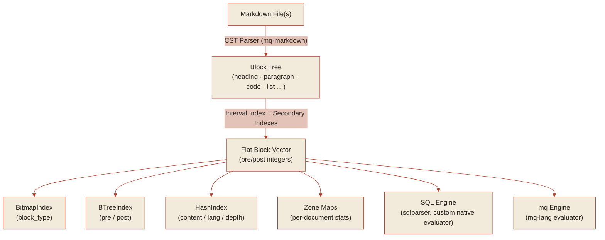

<div align="center">
  

<h1>mq-db</h1>

**Markdown-specialized embedded database with interval-indexed block storage and hierarchical query support.**

[](https://github.com/harehare/mq-db/actions/workflows/ci.yml)
[](https://github.com/harehare/mq-db/actions/workflows/audit.yml)
[](https://crates.io/crates/mq-db)
[](LICENSE)


</div>

`mq-db` treats Markdown documents as **structured, hierarchical databases** rather than plain text. It parses Markdown into a flat block list with an **interval index** (Nested Set / Pre-Post Order), enabling O(1) section hierarchy queries. Documents can be queried with **SQL** or **[mq](https://github.com/harehare/mq)** and persisted to a compact custom page-file format.


```mermaid
%%{init: {'theme':'base', 'themeVariables': {'primaryColor':'#f2ebdb','primaryTextColor':'#2a2420','primaryBorderColor':'#b3402c','lineColor':'#b3402c','secondaryColor':'#e3c3b7','tertiaryColor':'#faf6ef','background':'#faf6ef','fontFamily':'JetBrains Mono, monospace'}}}%%
flowchart TD
    A["Markdown File(s)"] -->|"CST Parser (mq-markdown)"| B["Block Tree\n(heading · paragraph · code · list …)"]
    B -->|"Interval Index + Secondary Indexes"| C["Flat Block Vector\n(pre/post integers)"]
    C --> D["BitmapIndex\n(block_type)"]
    C --> E["BTreeIndex\n(pre / post)"]
    C --> F["HashIndex\n(content / lang / depth)"]
    C --> G["Zone Maps\n(per-document stats)"]
    C --> H["SQL Engine\n(sqlparser, custom native evaluator)"]
    C --> I["mq Engine\n(mq-lang evaluator)"]
```

> [!IMPORTANT]
> This project is under active development and the API may change.

## Features

- **Flat block storage**: every Markdown element becomes a typed `Block` with row-polymorphic properties
- **O(1) hierarchy queries**: interval index (`pre`/`post`) makes ancestor/descendant checks a single integer comparison
- **Four-layer secondary indexes**: `BitmapIndex` (block type), `BTreeIndex` (pre/post), `HashIndex` (content/lang/depth), `TermIndex` (tokenized content, full-text) for fast SQL predicate pushdown
- **Zone Maps**: per-document statistics skip irrelevant files before scanning any blocks
- **Dual query engines**: SQL via a custom `sqlparser`-based evaluator, and `mq` via `mq-lang`
- **`WITH` / `WITH RECURSIVE` support**: common table expressions, usable in `FROM`, `JOIN`, and subqueries; recursive CTEs via iterative fixed-point evaluation
- **Full-text search**: `match()`/`score()` SQL functions backed by a persisted per-document inverted index
- **`EXPLAIN` / `EXPLAIN ANALYZE`**: see the zone-map/index/join plan a query resolves to, with actual row/timing stats under `ANALYZE`
- **Incremental re-indexing**: re-running `index` skips unchanged files (content-hash based), replaces changed ones in place (same `DocumentId`), and can `--prune` deleted ones
- **SQL `INSERT`/`UPDATE`/`DELETE` with write-back**: add, edit, or remove `blocks` and push the change back to the source Markdown file, opt-in via `--write-back`
- **DDL support**: `CREATE TABLE`, `INSERT INTO`, `DROP TABLE` for in-memory custom tables
- **`CREATE VIEW`**: persisted, live (non-materialized) named queries, re-run on every reference
- **Comprehensive SQL function library**: string, numeric, null-handling, `CASE`, and aggregate functions comparable to a general-purpose RDBMS
- **`mq()` scalar function**: run an mq program against Markdown content inline in SQL
- **`read_csv()` / `read_json()` table functions**: query external CSV/JSON Lines files directly in `FROM`, no import step
- **`ATTACH DATABASE` / `DETACH`**: query across multiple `.mq-db` stores as `<alias>.blocks`, session-scoped like SQLite
- **Custom page-file persistence**: 8 KB fixed pages, checksums, atomic writes
- **`vacuum`**: reclaim dead page chains left by write-back edits, `DROP TABLE`/`DROP VIEW`, and re-indexing changed files
- **CLI + interactive REPL + TUI**: full terminal experience

Full documentation, including the SQL/mq reference and architecture deep-dive, lives at **[db.mqlang.org/book](https://db.mqlang.org/book/)**.

## Installation

### Using the Installation Script (Recommended)

```bash
curl -fsSL https://raw.githubusercontent.com/harehare/mq-db/main/bin/install.sh | bash
```

The installer will:
- Download the latest release for your platform
- Verify the binary with SHA256 checksum
- Install to `~/.local/bin/`
- Update your shell profile (bash, zsh, or fish)

After installation, restart your terminal or run:
```bash
source ~/.bashrc  # or ~/.zshrc, or ~/.config/fish/config.fish
```

### Using Cargo

```bash
cargo install mq-db
```

### From Source

```bash
# Latest Development Version
cargo install --git https://github.com/harehare/mq-db.git
```

### Supported Platforms

- **Linux**: x86_64, aarch64
- **macOS**: x86_64 (Intel), aarch64 (Apple Silicon)
- **Windows**: x86_64

## CLI Usage

### Index Markdown files

```bash
mq-db index docs/ --recursive --output store.mq-db
mq-db index README.md DESIGN.md
mq-db index docs/ --no-spans   # omit source spans (~21 bytes/block saved)
```

```
  + docs/DESIGN.md
  + docs/API.md

2 added, 0 updated, 0 unchanged, 0 removed → store.mq-db
```

Re-running `index` against an existing `--output` is **incremental**: files
whose content hash hasn't changed are skipped, changed files are re-parsed
in place (keeping the same `DocumentId`), and new files are added. Pass
`--prune` to also drop catalogued documents whose file no longer exists:

```bash
mq-db index docs/ --recursive --output store.mq-db --prune
```

### List indexed documents

```bash
mq-db list --db store.mq-db
mq-db list --db store.mq-db --format json   # also: csv, tsv, markdown, html
```

```
┌──────┬────────────────────────────────────────────────────┬────────┬──────────┐
│   ID │ Path / Title                                       │ Blocks │ Tags     │
├──────┼────────────────────────────────────────────────────┼────────┼──────────┤
│    0 │ docs/DESIGN.md                                     │    142 │          │
│    1 │ docs/API.md                                        │     87 │ api, v2  │
└──────┴────────────────────────────────────────────────────┴────────┴──────────┘
2 documents
```

### Quick full-text search

`find` is a shortcut for `match()`/`score()` full-text search, no SQL needed. It falls back to a case-insensitive substring match too, so partial CJK queries still hit. Results show a snippet centred on the match, with matched terms highlighted when stdout is a terminal (respects `NO_COLOR`). See [Full-Text Search](https://db.mqlang.org/book/reference/full-text-search) for details and known limitations.

```bash
mq-db find "error handling" --db store.mq-db
mq-db find "error handling" --db store.mq-db -n 5 -F json   # top 5, JSON
```

```
docs/API.md  ¶   0.67  Error handling follows RFC 7807 problem details...
docs/API.md  #   0.25  Error Handling

2 matches
```

### SQL queries

```bash
mq-db sql "SELECT block_type, count(*) FROM blocks GROUP BY block_type" --db store.mq-db
mq-db sql --file query.sql --db store.mq-db           # read SQL from a file
mq-db sql "SELECT ..." --db store.mq-db --format json  # also: csv, tsv, markdown, html
```

```
┌─────────────┬──────────┐
│ block_type  │ count(*) │
├─────────────┼──────────┤
│ paragraph   │ 48       │
│ heading     │ 21       │
│ code        │ 15       │
└─────────────┴──────────┘
(3 rows)
```

**Hierarchy query with `under()`**: find all content inside a specific section:

```bash
mq-db sql "
  SELECT b.block_type, b.content
  FROM blocks b
  WHERE under(b.pre, b.post,
    (SELECT pre FROM blocks WHERE block_type = 'heading' AND content = 'Architecture'),
    (SELECT post FROM blocks WHERE block_type = 'heading' AND content = 'Architecture'))
  ORDER BY b.pre
" --db store.mq-db
```

**`mq()` scalar function**: run an mq program against Markdown content inline:

```bash
mq-db sql "SELECT mq('.h1 | to_text', content) AS title FROM blocks WHERE block_type = 'code'" --db store.mq-db
```

The SQL dialect also has CTEs, full-text search, `EXPLAIN`, external-file table functions, cross-store `ATTACH`, write-back DML, custom tables, and live views. Full reference and examples are in the book:

- [CTEs (`WITH` / `WITH RECURSIVE`)](https://db.mqlang.org/book/reference/cte)
- [Full-Text Search (`match()` / `score()`)](https://db.mqlang.org/book/reference/full-text-search)
- [`EXPLAIN` / `EXPLAIN ANALYZE`](https://db.mqlang.org/book/reference/explain)
- [External Files (`read_csv()` / `read_json()`)](https://db.mqlang.org/book/reference/external-files)
- [DDL Statements (custom tables, views, `ATTACH`/`DETACH`)](https://db.mqlang.org/book/reference/sql-ddl)
- [Write-Back (`INSERT`/`UPDATE`/`DELETE`)](https://db.mqlang.org/book/reference/write-back)

### mq queries

```bash
mq-db mq ".h1" --db store.mq-db
mq-db mq 'select(.code_lang == "rust")' --db store.mq-db
mq-db mq ".h1" --db store.mq-db --format markdown  # also: json, csv, tsv, html
```

### Interactive REPL

```bash
mq-db repl --db store.mq-db --mode sql
```

```
mq-db  (.help for commands  .quit to exit)
mode: sql  (.mode mq | .mode sql)

sql> SELECT content FROM blocks WHERE block_type = 'heading' LIMIT 3;
┌──────────────────┐
│ content          │
├──────────────────┤
│ Overview         │
│ Architecture     │
│ Query Engine     │
└──────────────────┘
(3 rows)

sql> .mode mq
→ mq mode
mq> .h2
## Architecture
## Query Engine
```

Pass `--write-back` to `repl` to allow `UPDATE`/`DELETE` on `blocks` in SQL mode:

```bash
mq-db repl --db store.mq-db --mode sql --write-back
```

### HTTP server

```bash
mq-db serve --db store.mq-db              # listens on 127.0.0.1:7878
mq-db serve --db store.mq-db --port 8080  # custom port
mq-db serve --db store.mq-db --host 0.0.0.0 --port 8080
```

`--host 0.0.0.0` exposes the query endpoints beyond localhost. When doing so, secure the server with an API key or Basic auth, and consider TLS and a rate limit:

```bash
mq-db serve --db store.mq-db --host 0.0.0.0 \
  --api-key "$MQ_DB_API_KEY" \
  --rate-limit 20 \
  --timeout 10 \
  --tls-cert cert.pem --tls-key key.pem
```

| Option                     | Description                                                                    |
| -------------------------- | -------------------------------------------------------------------------------- |
| `--timeout <SECS>`         | Abort a request and return `408` if it runs longer than this many seconds        |
| `--rate-limit <N>`         | Max requests per second per client IP; excess requests get `429`                 |
| `--api-key <KEY>`          | Require `Api-Key: <KEY>` or `Authorization: Bearer <KEY>` (env `MQ_DB_API_KEY`)   |
| `--basic-auth <USER:PASS>` | Require HTTP Basic auth (env `MQ_DB_BASIC_AUTH`)                                 |
| `--tls-cert` / `--tls-key` | PEM certificate/key pair to serve over HTTPS instead of plain HTTP               |

If both `--api-key` and `--basic-auth` are set, either credential grants access. `--tls-cert` and `--tls-key` must be provided together.

Three endpoints are available:

| Method | Path      | Body                   | Description                                          |
| ------ | --------- | ---------------------- | ---------------------------------------------------- |
| `GET`  | `/health` | (none)                 | `{"status":"ok","documents":<n>}`                    |
| `POST` | `/sql`    | `{"query":"SELECT …"}` | Execute a SQL query, returns JSON rows               |
| `POST` | `/mq`     | `{"code":".h1"}`       | Evaluate an mq expression, returns `{"results":[…]}` |

```bash
# Health check
curl http://127.0.0.1:7878/health

# SQL via HTTP
curl -s -X POST http://127.0.0.1:7878/sql \
  -H 'Content-Type: application/json' \
  -d '{"query":"SELECT block_type, count(*) FROM blocks GROUP BY block_type"}'

# mq via HTTP
curl -s -X POST http://127.0.0.1:7878/mq \
  -H 'Content-Type: application/json' \
  -d '{"code":".h1"}'
```

### Structural linting

```bash
mq-db lint --db store.mq-db --depth 2
```

```
✗  1 violation  (H2 immediately followed by list)

  file                                      heading
  ────────────────────────────────────────  ──────────────────────────────
  docs/DESIGN.md                            "Quick Start"
```

### Statistics

```bash
mq-db stats --db store.mq-db
```

```
  Documents  5
  Blocks     632

  Block types
  ────────────────────────────────────────────────────────
   ¶  paragraph    ████████████████████░░░░   241  (38%)
   #  heading      ████████░░░░░░░░░░░░░░░░    89  (14%)
  {}  code         ███████░░░░░░░░░░░░░░░░░    73  (12%)
   •  list         ██████░░░░░░░░░░░░░░░░░░    58   (9%)

  Code languages
  ────────────────────────────────────────────────────────
  {}  rust         ████████████████████████    41  (57%)
  {}  python       ██████████░░░░░░░░░░░░░░    18  (25%)
  {}  bash         ███████░░░░░░░░░░░░░░░░░    14  (19%)
```

### Compaction (VACUUM)

`UPDATE`/`DELETE` write-back, `DROP TABLE`/`DROP VIEW`, and re-indexing a changed file all replace or remove data by writing a fresh page chain and abandoning the old one, so the `.mq-db` file only grows. `vacuum` rewrites the file from scratch (same compaction `save`/`index` already do for a brand-new file) and reclaims that dead space:

```bash
mq-db vacuum --db store.mq-db
```

```
  Pages before   190
  Pages after    123
  Reclaimed      536.0 KB
```

`VACUUM` as a SQL statement is recognized but redirects to this command rather than doing something different or silently failing: mq-db's compaction operates on the whole store file, not per-table, so it doesn't fit the `--write-back`/`execute_sql_mut` path the way `UPDATE`/`DELETE` do.

### Show document structure

```bash
mq-db show 0 --db store.mq-db
```

```
  docs/DESIGN.md
  title   Design Document
  blocks  142

  pre   post  type               content
  ────  ────  ────────────────   ──────────────────────────────────────────
     0   141  heading H1         Design Document
     2    55  heading H2         Architecture
     4    21  paragraph          The system is built on…
    22    37  heading H3           Query Engine
    24    36  code                   fn main() { … }
```

### TUI

```bash
mq-db tui --db store.mq-db
```

```
 mq-db  SQL  Tab:switch  i:input  j/k:nav  d/u:scroll  q:quit
┌─ Documents ──────────┬─ SQL ────────────────────────────────────────────────┐
│ DESIGN.md            │ SELECT block_type, count(*) FROM blocks GROUP BY b_  │
│   142 blocks         ├─ Results ────────────────────────────────────────────┤
│ API.md               │ ┌─────────────┬──────────┐                           │
│   87 blocks  API     │ │ block_type  │ count(*) │                           │
│ README.md            │ ├─────────────┼──────────┤                           │
│   34 blocks          │ │ paragraph   │ 48       │                           │
└──────────────────────┴──────────────────────────────────────────────────────┘
 5 docs  632 blocks  3 rows
```

`Tab` cycles the input mode through SQL → **find** → mq, giving the [`find` CLI command](#quick-full-text-search)'s highlighted results right in the TUI.

**Keys:**

| Key            | Action                   |
| -------------- | ------------------------ |
| `i`            | Focus query input        |
| `Esc`          | Blur input               |
| `Enter`        | Run query                |
| `Tab`          | Cycle SQL / find / mq mode |
| `j` / `k`      | Navigate document list   |
| `d` / `u`      | Scroll results down / up |
| `g` / `G`      | Jump to top / bottom     |
| `q` / `Ctrl+C` | Quit                     |

## Library API

```rust
use mq_db::{DocumentStore, SqlEngine, MqEngine, block::BlockType};

// Build in memory
let mut store = DocumentStore::new();
store.add_file("docs/DESIGN.md")?;
store.add_str("# Hello\n\n## Architecture\n\nDetails\n")?;

// Chainable query API: zone-map skip + interval scope + block predicates
let chunks = store.query()
    .documents(|doc| doc.zone_maps.heading_contents.contains("Architecture"))
    .under_heading("Architecture", Some(2))
    .filter(|b| matches!(b.block_type, BlockType::Paragraph | BlockType::Code))
    .blocks();

// SQL engine (custom sqlparser-based evaluator, no SQLite dependency)
let engine = SqlEngine::new(&store)?;
let out = engine.execute(
    "SELECT content FROM blocks WHERE block_type = 'heading' ORDER BY pre"
)?;
print!("{}", out.to_table());

// mq engine
let results = MqEngine::eval_store(".h1", &store)?;

// Structural lint
let violations = store.query().lint_heading_followed_by(2, &[BlockType::List]);

// Incremental re-index: skips unchanged files (content-hash based), replaces
// changed ones in place (same DocumentId), adds new ones; prune=true drops
// missing paths.
let report = store.reindex_paths(&[std::path::PathBuf::from("docs/DESIGN.md")], false)?;
println!("{} added, {} updated, {} unchanged", report.added.len(), report.updated.len(), report.unchanged);

// UPDATE/DELETE with write-back: rewrites the affected block's source file
// (heading/paragraph content only), then re-parses it in place.
store.execute_sql_mut(
    "UPDATE blocks SET content = 'New Title' WHERE block_type = 'heading' AND content = 'Old Title'"
)?;

// Persist / load
store.save("store.mq-db")?;

// Full load: all blocks read into memory, indexes built on first SqlEngine use
let store = DocumentStore::load("store.mq-db")?;

// Lazy open: catalog only; call load_all_blocks() + load_all_indexes() before SQL
let mut store = DocumentStore::open("store.mq-db")?;
store.load_all_blocks()?;
store.load_all_indexes()?;

// Catalog-only: for metadata commands (list, stats) that don't need block data
let store = DocumentStore::load_catalog_only("store.mq-db")?;
```

See the book's [Library API](https://db.mqlang.org/book/start/library) page for the loading-strategy comparison and the full query-builder reference.

## SQL Reference

The virtual schema (`documents`/`blocks`), the full built-in function library (mq-db-specific, string, numeric, date/time, null-handling, and aggregate functions), and the DDL statement list live in the book, along with a set of worked example queries:

- [Virtual Schema](https://db.mqlang.org/book/reference/sql-schema)
- [Built-in Functions](https://db.mqlang.org/book/reference/sql-functions)
- [DDL Statements](https://db.mqlang.org/book/reference/sql-ddl)
- [Example Queries](https://db.mqlang.org/book/reference/sql-examples)

A quick taste:

```sql
-- H2 headings immediately followed by a list (structural lint)
SELECT d.path, h.content AS heading
FROM blocks h
JOIN blocks nxt ON nxt.document_id = h.document_id AND nxt.pre = h.pre + 1
JOIN documents d ON d.id = h.document_id
WHERE h.block_type = 'heading' AND depth = 2 AND nxt.block_type = 'list';

-- Bucket headings by depth and summarize with string/numeric functions
SELECT
  CASE WHEN depth <= 1 THEN 'top-level' ELSE 'nested' END AS bucket,
  count(*),
  group_concat(initcap(trim(content)), ', ') AS headings
FROM blocks
WHERE block_type = 'heading'
GROUP BY CASE WHEN depth <= 1 THEN 'top-level' ELSE 'nested' END;
```

## Architecture

Every Markdown element becomes a `Block` (a typed struct with `pre`/`post` interval-index bounds and row-polymorphic `properties`), indexed through three complementary layers, cheapest-first: **Zone Maps** (document-level skip), the **Interval Index** (section hierarchy, `pre`/`post` containment), and **Secondary Indexes** (`BitmapIndex`/`BTreeIndex`/`HashIndex`/`TermIndex`). Documents persist to a custom 8 KB page file with atomic writes.

See the book for the full architecture, with diagrams and the on-disk byte layout:

- [Block Model](https://db.mqlang.org/book/reference/block-model)
- [Index Layers](https://db.mqlang.org/book/reference/index-layers)
- [Storage Format](https://db.mqlang.org/book/reference/storage-format)

## Support

- 🐛 [Report bugs](https://github.com/harehare/mq-db/issues/new)
- 💡 [Request features](https://github.com/harehare/mq-db/issues/new)
- ⭐ [Star the project](https://github.com/harehare/mq-db) if you find it useful!

## Contributing

Contributions are welcome! Feel free to open an issue or submit a pull request.

## License

[MIT](LICENSE)

